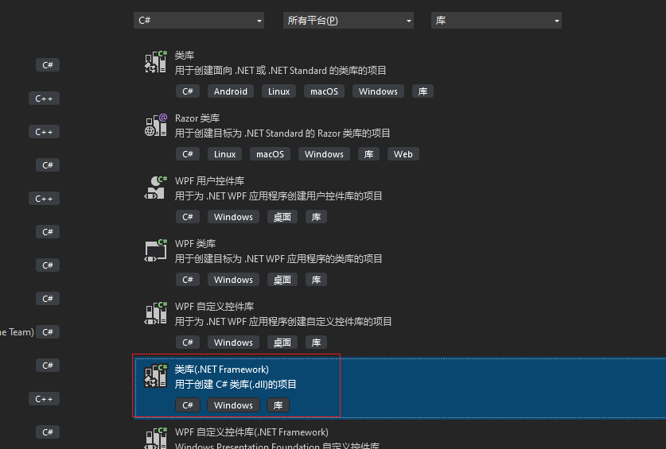

# 基础环境配置

## Celeste

> 如果你不是 Windows 用户的话这一步你可以直接跳过.

原因是 Everest 需求我们使用 FNA 版本的蔚蓝, 而 Linux 和 MacOS 上的蔚蓝已经就是 FNA 版本了, 而在 Windows 上则是 XNA 版本, 所以我们需要一些方法切换到 FNA 版本:

- 在 Steam 上:  库->Celeste, 右键菜单属性->测试版->Opengl
- 在 itch 上: 重新下载一个 `Celeste Windows OpenGL` 版本
- 在 Epic 上: Epic 的蔚蓝都是 FNA 版本, 你不需要做任何事情

> Everest 会在运行时将你的 FNA mod 重链接为 XNA, 所以你不需要担心这两个版本造成的不兼容

> 注意更换版本后你通常还需要重新给新版本安装上 Everest


## IDE 与 开发环境

因为我们是 CodeMod, 嗯, 那么写一些代码是必不可少的, 那么一般情况下拥有一个 IDE 在这一步会舒畅很多, 在这里我会推荐 `Visual Studio`, `Visual Studio Code`, `Rider`, 后两个是跨平台的而第一个是仅 Windows 的. 

- 对于 `Visual Studio`, 你需要安装 `.NET 开发负载`. (在`Visual Studio Installer`中)
- 对于 `Visual Studio Code`, 你需要安装 `C#` 拓展.

在之后我会更倾向于在 `Windows` 上使用 `Visual Studio`, 所以其他编辑器/IDE/平台可能不怎么会提, 如果你有什么问题的话你可以在任何找到我的地方包括群里问我(, 问的多的话我会写在这个教程里的_(:з」∠)_

## 项目创建

#### 对于 `Visual Studio`

你需要在创建项目页面选择这个:
  
注意选择带 `.NET Framework` 字样的, 因为蔚蓝的底层框架相对于目前的 `.NET` 发展已经很古老了, 所以可能 vs 不怎么期望你创建这个项目(, 然后在选择项目框架时记得精确选择 `.NET Framework 4.5.2`.

那么当你创建完项目后你会得到一个代码文件 `Class1.cs` 以及里面的代码:
```cs
using System;
using System.Collections.Generic;
using System.Linq;
using System.Text;
using System.Threading.Tasks;

namespace MyCelesteMod
{
    public class Class1
    {

    }
}

```

## 添加引用

因为我们是蔚蓝 mod 嘛, 所以肯定得依赖一些蔚蓝的东西, 具体操作就是在解决方案识图的`引用`上右击, 然后选择`添加引用`, 在新的窗口的左侧选择`浏览`, 这时点击窗口右下角的`浏览`, 在这个文件选择框里选择以下几个在蔚蓝根目录下的文件:

- Celeste.exe
- FNA.dll
- MMHOOK_Celeste.dll
- YamlDotNet.dll

另外为了保证你的 mod 的跨平台性, 你的引用列表里 `System` 开头的只能包含:

- System
- System.Configuration
- System.Core
- System.Data
- System.Drawing
- System.Runtime.Serialization
- System.Security
- System.Xml
- System.Xml.Linq

如果你的项目引用有其他`System`系列的不在上述列表上的你需要将其移除(通过右击移除).

## 添加 Module 类

ok在我们一番折腾下我们终于可以开始来写代码了, 那么首先把你的 `Class1.cs` 重命名成 `(你的mod名)Module.cs`, 比如这里我的 mod 名叫 `MyCelesteMod`, 那么这个文件最好叫做 `MyCelesteModModule.cs`, 这是为了方便日后开发能一眼识别出这是我们最早期创建的那个关键类.

> 如果你的 vs 提示你是否重命名标识符, 你可以选是, 这样那个文件里的`Class1`类名也会帮你重命名

那么同样地对这个文件里的类的名字也重命名, 然后我们让这个类继承于 `EverestModule`

> 如果出现了未命名标识符的错误, 请检查你是否正确引用了 `Celeste.exe` 并且 using 了 `Celeste.Mod` 命名空间

那么现在我们需要加入两个方法以实现这个抽象类<del>, 同时让vs闭嘴</del>.
```cs
public override void Load()
{
}

public override void Unload()
{
}
```

`Load` 方法会在 Everest 加载你的 Mod 时被调用, `Unload` 方法会在 Everest 卸载你的 Mod 时被调用, 在这里我们写个类似 Hello world 的东西, 即在 `Load` 里打印些话. em, 可能不是你期望的 `Console.WriteLine` 而是 `Logger.Log`, 就像这样:

```cs
Logger.Log(LogLevel.Info, "MyCelesteMod", "Hello World! Hello Everest!");
```

- 第一个参数设置了这句日志的等级, 这里我们先选 `Info`.
- 第二个参数设置了这句日志的 `Tag`, 通常它是你的 Mod 名字
- 第三个参数就是我们希望输出的话

现在, 按下 `Ctrl + B`, vs 应该会启动编译.
> 你会遇到一个关于 `x86` 与 `AnyCpu` 架构不符的警告, 这里我们先忽略它.

编译完成, 我们就可以找到我们编译出来的新鲜的程序集: `<你的项目名>/<你的项目名>/bin/Debug/<你的项目名>.dll`

## 让 Everest 加载

以上一顿操作过后你会发现你的蔚蓝什么也没发生(乐). 因为我们还没告诉它让它加载我们的 mod! 为了让 Everest 加载我们的 mod, 我们首先需要在蔚蓝的 Mods 文件夹里面新建一个文件夹并放入我们的 mod 文件, 它的名字我们最好就是项目名字, 即 `MyCelesteMod`, 然后在这里写一份带我们 mod 信息的 `everest.yaml` 文件:
```yaml
- Name: <mod名字>
  Version: <版本>
  DLL: <dll位置>
  Dependencies:
    - Name: Everest
      Version: <依赖的everest版本>
```
ok我们的 mod 名字是`MyCelesteMod`, 由于是开发早期, 版本指定为`0.1.0`, 然后你正在使用的 `Everest` 版本是 `3876`, 然后是 Dll 位置, 我们先把之前编译的新鲜<del>(可能现在不咋新鲜了)</del>的 dll 复制到这里来, 没记错的话在这里叫 `MyCelesteMod.dll`, ok, `everest.yaml` 里要写的 dll 位置是相对于这个文件夹的, 我们就放在它里面第一层, 所以我们直接写 `MyCelesteMod.dll` 就行了.

现在你的那个文件夹现在可能长这个样子:

- MyCelesteMod
  - MyCelesteMod.dll
  - everest.yaml

everest.yaml可能长这个样子:
```yaml
- Name: MyCelesteMod
  Version: 0.1.0
  DLL: MyCelesteMod.dll
  Dependencies:
    - Name: Everest
      Version: 1.3876.0
```

ok, 在见证奇迹之前我们还要干最后一件小事, 就是我们的日志是打印在文件里的同时也打印在控制台里的, 虽然能在日志文件里看到我们的 Hello world 但是为了日后方便调试我们还是先让蔚蓝启动的同时启动一个控制台好一点. Everest 已经为我们做了这件事了, 我们要做的就是在蔚蓝exe同目录下找到`everest-launch.txt`, 额, 没找到也没关系, 新建一个就可以了, 然后在里面写上`--console`, 是的就这一小点东西, 然后我们保存, 启动蔚蓝!

在同时弹出的控制台窗口扫视一下:
```log
[MonoMod] [AutoPatch] Patch pass
[MonoMod] [AutoPatch] PatchRefs pass
[MonoMod] [PostProcessor] PostProcessor pass #1
[MonoMod] [Write] Writing modded module into output file.
(07/05/2023 23:22:16) [Everest] [Info] [MyCelesteMod] Hello World! Hello Everest!
(07/05/2023 23:22:16) [Everest] [Info] [core] Module MyCelesteMod 0.1.0 registered.
(07/05/2023 23:22:16) [Everest] [Info] [loader] Loading mods with unsatisfied optional dependencies (if any)
FNA3D Driver: D3D11
D3D11 Adapter: Intel(R) UHD Graphics 630
BEGIN LOAD
 - GFX LOAD: 139ms
 - MTN LOAD: 9ms
WINDOW-1600x900
GAME DISPLAYED (in 291ms)
 - AUDIO LOAD: 454ms
 - GFX DATA LOAD: 75ms
```
大概在如上的位置附近(在这里是第5行)你就能找到你的 Hello world 了, 至此基本环境配置结束.


最后修改: 2023-7-5