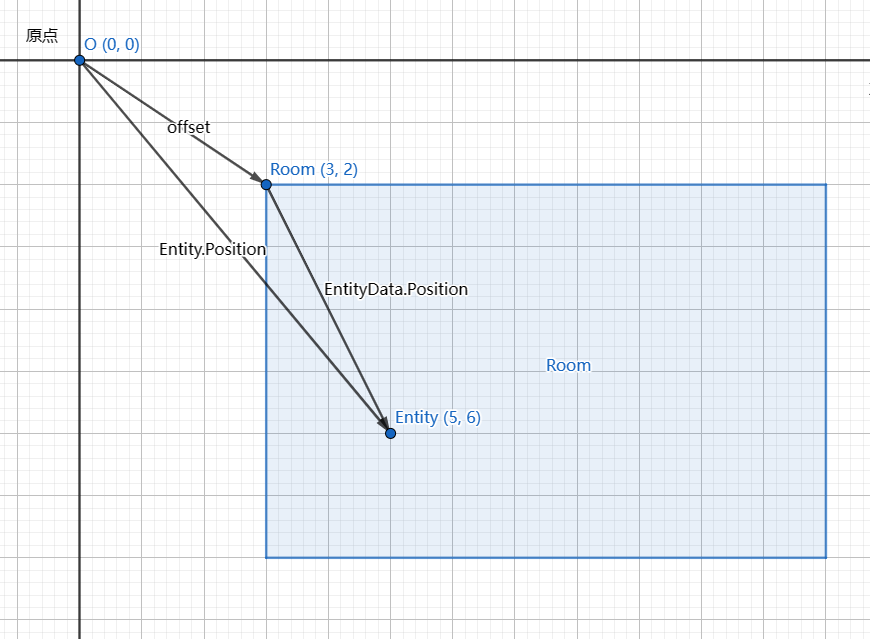
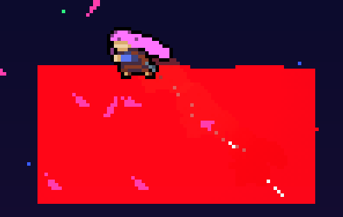

# 简单自定义实体

在知道一些 mod 制作中最为基础的东西后, 我们首先把兴趣点转向自定义实体,
相信相对于修改已有的东西并伴随着一定的烧脑(我该怎么改? 这么改会不会破坏官图元素?), 你可能更喜欢自己制作一个实体, 那就对了!
在这一节, 我们会了解 loenn 的基础使用、添加一个自定义实体的通用步骤, 以及一些游戏常用的方法!

## 我们的自定义实体类

### 它能干什么

在开始制作这个自定义实体之前, 我们先明白一下这个实体做出来是什么效果的.  
那么, 为了简单起见, 这里就做一个简单的功能, 它大概是:

- 它叫做 `PassByRefill`
- 长度和宽度是随意的
- 它看起来是个透明的红色物体
- 玩家与其碰撞时会锁定为某个冲刺数
- 这个冲刺数可以在作图软件中设置

是的就这样简单, 那么我们开始吧.

### 声明这个类

!!! warning
    在前面我们钩取了 `Player.Update()` 并且在一直修改冲刺数为 1!  
    不要忘记把钩子函数以及钩取和取消钩取的那些代码删掉,
    最后你的 Module 类应该只包含两个空的 `Load` 和 `Unload` 方法!

首先在代码中, 我们需要声明这个类, 也就是创建一个 .cs 文件, 然后命个名.
在这里你还需要继承一下 `Entity`, 在前面我们已经了解过了它是 `Monocle` 的一个类, 表示场景中的实体.  
那么你应该会写出如下的代码:

```cs title="PassByRefill.cs"
namespace MyCelesteMod;

public class PassByRefill : Entity
{

}
```

ok, 接下来, 我们加一个表示冲刺数的字段, 然后搞一个构造函数接收并赋值它:
```cs title="PassByRefill.cs"
public int Dashes = 0;

public PassByRefill(Vector2 position, Vector2 size, int dashes)
{
    Position = position;
    Dashes = dashes;
}
```

这里的 `position` 参数会被用于设置它的 `Position` 字段, 这个字段从 `Monocle.Entity` 继承而来, 它表示这个 `Entity` 在场景中所在的位置(世界坐标).  
`Vector2` 是一个 XNA 中的结构体, 包含一个 `X` 和一个 `Y` 的 `float` 字段, 它用于描述空间中的位置, 就像你在平面直角坐标系中所做的一样!  
不过这里需要注意, 游戏中的坐标系和我们通常数学中的坐标系**不同**, 它的顶点在**左上角**, **X 轴水平向右**但是 **Y 轴竖直向下**! 切记不要搞混了.  
`Vector2` 同时也可能表示大小, 即 `X` 字段表示宽度, `Y` 字段表示长度, 在这里我们用它来接收它的大小.  
你可能注意到我们并没有理 `size` 这个表示大小参数, 稍等一下, 我们在本节后边就会使用它了.




接下来, 我们需要声明一个特殊的构造函数, 这个构造函数**由 Everest 反射调用**, 用于将作图软件那边的数据传递给我们:
```cs title="PassByRefill.cs"
public PassByRefill(EntityData data, Vector2 offset) 
        : this(data.Position + offset, new Vector2(data.Width, data.Height), data.Int("dashes"))
    { }
```
在这里, `EntityData data` 储存了作图软件保存的相关数据, 我们要提取它们很简单,
比如说我们要提取一个名为 `dashes` 的 `int` 类型的数据, 我们就简单地调用它的方法 `Int(string name)` 就得到了,
然后是它的大小数据, 由于大小是个特殊的东西, 这里我们可以直接通过 `Width` 和 `Height` 属性提取并 `new` 一个 `Vector2` 结构体来传递给我们上面的构造函数.
对于更多方法以及这部分数据该如何自定义我们会在本节后半部分说明.  
`Vector2 offset` 表示这一面的最左上角的**世界坐标**, `EntityData` 的 `Position` 是物体**相对**于这一面最左上角的坐标,
所以我们需要把它相加来得到世界坐标.(因为 `Entity.Position` 永远只接受世界坐标!)

!!! info
    这个构造函数的参数列表也能为其他的样子, 但是我们最最最常用的一个版本就是上面这个

### 让 Everest 找到它

现在我们只定义了一个类 Everest 那边是啥也不知道的, 所以我们得告诉它, 而这个过程我们一般就叫 `注册`.  
要注册一个自定义实体非常简单, 我们只需要将 `CustomEntity` (在命名空间 `Celeste.Mod.Entities` 中) 装饰到我们的类上并传入我们实体的 "名称 ID". 就像:
```cs title="PassByRefill.cs"
[CustomEntity("MyCelesteMod/PassByRefill")]
public class PassByRefill : Entity
{
......
```
在这里 "名称 ID" 我们一般推荐以 "{Mod名}/该实体类名" 进行命名, 就像这里一样, Mod 名为 `MyCelesteMod`, 类名为 `PassByRefill`, 实体 "名称 ID" 就是 `MyCelesteMod/PassByRefill`. 这里我建议你记住它, 待会我们会在作图软件配置的时候用到.

## Loenn

!!! info "作图软件"
    蔚蓝的作图软件最流行的目前有 `ahorn` 与 `loenn`, 不过我更推荐 `loenn`, 因为 `ahorn` 实在是 太!!卡!!了!!

### 基础使用

Loenn 是一个蔚蓝的作图软件, 当然这里我们使用它不是制作出精美的地图, 而是仅仅放置一下我们的自定义实体!  
\_(:з」∠)\_, 这里我不怎么想重复它的基础使用, 所以我推荐你去以下几个视频中了解:

- [Bilibili 【Celeste蔚蓝】电箱作图教程重置版 0-1 Loenn的安装](https://www.bilibili.com/video/av354525627/)
- [Bilibili 【Celeste蔚蓝】电箱作图教程重置版 1-1 Loenn的使用](https://www.bilibili.com/video/av782056152/)

!!! note "版本"
    如果你之前已经下载了 Loenn, 我建议你确保它升级到最新版了, 因为接下来的某些东西我可能不太记得是哪个版本引入的了.

### 让 Loenn 找到我们的实体

相信你现在已经懂的 Loenn 基本的使用用法了, 那么现在, 我们要给 Loenn 写一些东西让它知道我们这个实体 mapper 们能用了.  
首先我们在 ModFolder 下新建一个叫 `Loenn` 的文件夹, 再在里面新建一个叫 `entities` 的文件夹, 再在里面新建一个叫 `PassByRefill.lua` (也就是`{实体类名}.lua`) 的文本文件.
现在你的目录结构应该是这样的:

- ModFolder
    - Loenn
        - entities
            - PassByRefill.lua

ok, 然后我们打开 `PassByRefill.lua`, 这是一个 `lua` 语言的源文件, 这里我们不需要很多 `lua` 知识, 直接照着抄就好了:

```lua title="PassByRefill.lua"
local entity = {}

entity.name = "MyCelesteMod/PassByRefill"
entity.placements = {
    name = "normal",
    data = {
        width = 16,
        height = 16,
        dashes = 1
    }
}

return entity
```

还记得我们之前记住的实体 "名称 ID" 吗? 在这里你就需要将其赋值给 `entity.name`.  

- 然后是 `entity` 的 `placements`, 它表示这个实体的放置选项, 在这里我们先不管, 你就理解为你希望 Loenn 怎么把你这个实体拆分为多个放置选项, 这里我们的写法表示不希望 Loenn 拆分它, 如果这里的 `placements` 是个数组的话那么 Loenn 就会拆分它了.
    - 继续到 `name` 属性, 它表示这个放置选项的名称, 这个名称是任意的, 它只被用来作为本地化键名(本地化就包括我们常说的"汉化").
    - 然后是 `data` 属性, 它表示这个实体的数据.
        - 在这里我们声明了三个数字类型的属性: `width`, `height`, `dashes`, 前两个属性是特殊的, 在代码中提取只需要对 `EntityData` 获取 `Width`/`Height` 字段即可.  
        - 第三个 `dashes` 属性就是我们的自定义属性

在 `data` 对象里的属性, 后面的等号就表示它的默认值, 比如 `width` 默认为 16, `dashes` 默认为 1.
!!! note tip
    如果你不声明 `width` 和 `height` 属性的话 Loenn 似乎会直接禁止你放置这个实体.

好吧看起来上面这一坨\*非常难懂\*, 不过没关系, 只要你会直接复制上面的东西, 改一下 `entity.name`, 向 `data` 里加一些属性就行了. 实际上我也是这么做的.  

那么, 重新编译我们的项目, 让 `msbuild` 把我们的东西复制过去, 这时打开我们的 Loenn (或者重启 Loenn), 搜索一下 `@MyCelesteMod`.
那么列表上应该只会出现一个名字很奇怪的选项(因为我们还没配置本地化相关的东西!), 现在把它放到任何你喜欢的地方, 打开它的属性框, 我们就能看到一个大大的 `dashes`
属性在上面允许我们改啦. 你可能注意到它是全白的! 因为我们还没告诉 Loenn 它长什么样! 不过这个等以后我们再来搞.

## 回到代码

现在在游戏中进入放了我们那个实体的那张图, 然后到之前你喜欢的那个地方, 然后... 是的, 你啥也不会看见, 因为我们也没告诉游戏它长什么样! 同时你走到它附近, 也不会发生任何事,
因为我们也没告诉游戏这个实体应该干什么!

### 告诉游戏它该做什么

那么, 就像前面描述的一样, "玩家与其碰撞时会锁定为某个冲刺数", 那么我们需要做一些碰撞. 在 `Monocle` 里这项工作很简单, 我们首先在构造函数里去 `new` 一个长方形的碰撞箱:
```cs title="PassByRefill.PassByRefill"
public PassByRefill(Vector2 position, Vector2 size, int dashes)
{
    Hitbox hitbox = new(size.X, size.Y);
}
```
!!! info
    我们在这里用到了之前的 `size` 参数

`Hitbox` 就是我们想要的长方形碰撞箱, 它的唯一的构造器接收四个参数, 前两个参数为它的宽高, 后两个参数为这个碰撞箱的偏移(因为碰撞箱我们要附加到 `Entity` 身上, 所以会有偏移这个东西),
这两个参数默认都为 0.  
然后设置到 `Entity` 身上:
```cs title="PassByRefill.PassByRefill"
Collider = hitbox;
```
`Collider` 是 `Entity` 的一个属性, 它表示这个 `Entity` 自身的碰撞箱.  
`Collider` 属性是 `Collider` 类型的, 它是一个抽象类表示一个碰撞体, 这里我们的 `Hitbox` 就是它的一个实现, 也就是一种长方形的实现.  

碰撞箱设置完后, 我们就该在 `Update()` 检测碰撞了, 这很简单~
```cs title="PassByRefill.Update()"
public override void Update()
{
    base.Update();
    // 获取 Player 实例 (别害怕!)
    var player = Scene.Tracker.GetEntity<Player>();

    // 检测是否与玩家碰撞
    if (this.CollideCheck(player))
    {
        // 如果碰撞了, 那么设置它的冲刺数
        player.Dashes = this.Dashes;
    }
}
```

相信你看到第五行一定会被吓一跳! 相信那一串东西对于新人来说一定很复杂, 不过没关系, 你只需要知道那一串会返回在场的那个玩家就行.  
然后我们用 `Entity` 的 `CollideCheck` 检查我们又没有与玩家发生碰撞, 如果有则强制设置它的冲刺数.  
由于我们每一帧都在检查, 都在设置, 所以最终的效果就是玩家一旦进入这个区域, 冲刺数被锁定为 `Dashes`.

!!! info
    实际上这里有更好的方法来单独检测与玩家的碰撞, 为了简单起见这里没有采用. 不过我们依然会在后面提到("常见 Celeste, Monocle 类"节).  
    第一行的 `base.Update()` 会**遍历调用**该 `Entity` 的所有 **`Component` 的 `Update()`**, 通常我们需要**在开头就调用**它. 后面的 `Render()` 也是.

### 告诉游戏它长什么样

那么, 功能做好后, 的让玩家看见, 为了简单起见这里我们不打算使用图片, 只是像前面描述的一样, 它是个"透明的红色物体",
在这里我们需要重写 `Entity` 的 `Render()` 方法来绘制一个纯色长方形,
它会在游戏中每帧都会被调用, 就像 `Update()` 一样,
不过切记不要在这两个方法里干不相关的事! 你应该在 `Update()` 里**只**更新你的逻辑, 而在 `Render()` 里**只**做绘制.  
这里我们选择绘制一个透明的红色长方形, 我们需要借助这个函数:
```cs title="Monocle.Draw.Rect"
Draw.Rect(Vector2 position, float width, float height, Color color)
```
- 第一个参数是我们希望绘制的位置(世界坐标)
- 第二个参数是我们希望绘制的宽度 
- 第三个参数是我们希望绘制的高度
- 第四个参数是我们希望绘制的颜色

我们在这里会这样用它:

```cs title="PassByRefill.Render()"
base.Render();
Color c = Color.Red;
c.A = 127;
Draw.Rect(Position, Width, Height, c);
```

首先我们获取一个红色的 `Color`, 然后设置透明度为 `127`, 然后调用这个方法绘制.  
你可能注意到 `Width` 和 `Height` 这两个东西, 它是 `Entity` 的两个属性, 默认它们都是 0, 在你加入碰撞箱的瞬间他们会变成碰撞箱的宽和高,
在这里它们的值就是我们之前设置的 `Hitbox` 的宽高.

## 准备就绪

那么, 一切就绪, 编译你的项目, 到那个地方, 在半透明红色的区域里享受锁定冲刺数的快乐吧!



如果你遇到了困难, 你可以对比一下最终的代码:
```cs title="PassByRefill.cs"
using Celeste.Mod.Entities;

namespace MyCelesteMod;

[CustomEntity("MyCelesteMod/PassByRefill")]
public class PassByRefill : Entity
{
    public int Dashes = 0;

    public PassByRefill(Vector2 position, Vector2 size, int dashes)
    {
        Dashes = dashes;
        Position = position;
        Hitbox hitbox = new(size.X, size.Y);
        Collider = hitbox;
    }

    public PassByRefill(EntityData data, Vector2 offset)
        : this(data.Position + offset, new Vector2(data.Width, data.Height), data.Int("dashes"))
    { }

    public override void Update()
    {
        base.Update();
        var player = Scene.Tracker.GetEntity<Player>();
        if (this.CollideCheck(player))
        {
            player.Dashes = this.Dashes;
        }
    }

    public override void Render()
    {
        base.Render();
        Color c = Color.Red;
        c.A = 127;
        Draw.Rect(Position, Width, Height, c);
    }
}
```

## 更多

### 为什么在 Loenn 中我能设置 dashes 为小数?

在 Loenn 中如果你没有显式指定某个数字 data 的类型的话它默认会是浮点数,
也就是你能输入小数, 不过这不会**很**影响(还是有的!)代码那边, 所以我们得跟 Loenn 说一下它是个整数!
```lua title="PassByRefill.lua"
entity.fieldInformation = 
{
    dashes = {
        fieldType = "integer"
    }
}
```
在这里我们设置了一个新的属性 `fieldInformation`, 然后在里面告诉 Loenn 我们的 `dashes` 这个属性的 `fieldType` 是 `integer`, 也就是整数.  
那么现在再重新编译, 重启 Loenn, 你应该会看到 Loenn 只允许你输入整数了.

### 为 Loenn 侧配置本地化以及贴图

咕了, 之后再写.