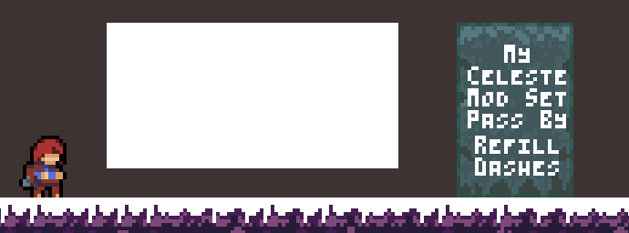
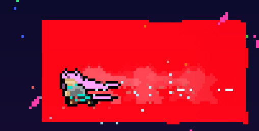

# 简单自定义 Trigger

如果你是一位 Mapper 的话那你一定知道 Trigger 是多么重要的存在. 在这里可能不是很能在短篇幅内说明 Trigger 的重要性, 这里只简单举几个例子:

- 绝大部分镜头的移动与偏移
- 剧情的触发, 无单双冲的切换
- 风的改变
- 重生点的设置
- 音乐参数的设置
- 背景的渐变, 前景的各种变换

以上几个例子不说绝大部分, 也有很大的占比都是由 Trigger 完成的.  
Trigger 是 Entity 的子类, 它带有一个长方形的碰撞箱, 通常它是对玩家不可见的, 当玩家 `进入(OnEnter)`, `保持(OnStay)`, `离开(OnLeave)` 会分别执行不同的动作,
比如说当玩家 `进入` 改变风的 Trigger 时会改变场上的风的情况, 当玩家 `保持` 在镜头偏移改变 Trigger 里时会保持镜头相对于玩家的偏移于一个值.

!!! info
    在官图第九章假心附近的 Trigger 看上去就像:  
      
    在这里, 左边有个设置重生点的 Trigger, 中间有个保持镜头位置的 Trigger, 而在右边有个更改背景的 Trigger.

那么, 是时候制作一个属于我们自己的 Trigger 了, 简单起见这里我们只做几个最简单的功能:

- 它叫 `SetPassByRefillDashesTrigger`
- 玩家进入后修改场上所有我们之前的 `PassByRefill` 实体的冲刺数
- 没了, 是的, 就是这么简单!

## 像对 Entity 一样地做准备工作

首先在代码中准备我们的类, 不过这次我们继承的是 `Trigger`. 哦对了, 它还会要求声明一个带参的构造函数,
因为 `Trigger` 基类没有无参构造器, 所以你可能需要像如下一样声明一下:
```cs title="SetPassByRefillDashesTrigger.cs"
[CustomEntity("MyCelesteMod/SetPassByRefillDashesTrigger")]
public class SetPassByRefillDashesTrigger : Trigger
{
    public SetPassByRefillDashesTrigger(EntityData data, Vector2 offset)
        : base(data, offset)
    {

    }
}
```
你可能会发现其实它要求的就是 Everest 要求我们定义的那个! 那刚好我们就不用再额外定义一个了.  
然后我们稍作更改, 以让它也能提取到一个叫 `dashes` 的数据:
```cs title="SetPassByRefillDashesTrigger.cs"
public int Dashes;

public SetPassByRefillDashesTrigger(EntityData data, Vector2 offset)
    : base(data, offset)
{
    Dashes = data.Int("dashes");
}
```

!!! info "构造函数链"
    形如 `: base(data, offset)` `: this(position)` 的这种语法叫做**构造函数链**, 这一部分似乎很多 C# 教程没有特别提及,
    如果你对此不是很了解的话我推荐你去查阅了解该语法.

你可能注意到 Trigger 一般都是有宽度和高度的, 在这里我们并没有用 `EntityData data` 去获取, 而且我们也没设置它的 `Position`!
实际上当你 `: base(data, offset)` 时这些事情已经由父类 Trigger 的构造函数做了, 如果你好奇可以翻阅 `Trigger` 构造函数附近的代码.

??? info "Trigger.Trigger(EntityData data, Vector2 offset)"
    ```cs
    /// .......
    public Trigger(EntityData data, Vector2 offset)
        : base(data.Position + offset)
    {
        base.Collider = new Hitbox(data.Width, data.Height);
        Visible = false;
    }
    /// .......
    ```

## Trigger 的实际功能

ok 现在让我们想想我们的 Trigger 的功能如何实现. 它大概就是:

- 检测玩家是否进入
    - 设置场上所有 `PassByRefill` 的 `Dashes` 字段
- 没了

在这里我们会使用 Trigger 的 `OnEnter` 虚函数, 它会在玩家**首次**进入的**1帧**被调用**1次**.
```cs  title="SetPassByRefillDashesTrigger.cs"
public override void OnEnter(Player player)
{
    base.OnEnter(player);
}
```

!!! note
    蔚蓝内部大部分虚函数重写时最好在开头调用一遍基类的实现, 除非你真的知道它做了什么并且你真的**不需要**它.

然后是获取场上所有的 `PassByRefill`, 以便我们能设置它们的 `Dashes`. 这里我们会搬出一个你可能眼熟的一串:
```cs title="SetPassByRefillDashesTrigger.OnEnter(Player player)"
// 获取所有的 PassByRefill
var refills = Scene.Tracker.GetEntities<PassByRefill>();
```

在这里或许该介绍介绍这一串是什么了, 首先我们通过 `Scene` 属性获取自身所在的场景, 然后获取它的 `Tracker`.  
Tracker 是蔚蓝场景内的一个辅助类, 它可以很快的帮你筛选出场上的实体, 在这里我们使用它的 `GetEntities<T>` 来筛选出所有类型为 `T`, 也就是 `PassByRefill` 的实体.  
部分实体在场上可能永远只有一个实例时, 比如说我们的 `Player`, 除非你安装了奇奇怪怪的 mod, 否则它永远只有一个实例, 这种情况下我们可以使用 `GetEntity`, 它只会返回一个实例.
那么你现在应该懂得之前我们写下的 `Scene.Tracker.GetEntity<Player>()` 是什么意思了: "使用场景的 Tracker 获取场上唯一的那个 Player 实例".  

哦对了, 我们还得在我们想要 Tracker 获取的实体的类上加一个 `Tracked` 特性, 就像:
```cs title="PassByRefill.cs" hl_lines="2"
[CustomEntity("MyCelesteMod/PassByRefill")]
[Tracked]
public class PassByRefill : Entity
{
```
这一步其实**很容易被忘记**, 就像我写完初稿并做到最后一步游戏崩溃时才想起来(乐).

好的然后我们该设置 `PassByRefill` 们的 `Dashes`... 额等等! 你可能会发现这里的 `refills` 局部变量其实是个 `List<Entity>` 类型, 这个我不太清楚为什么,
估计是一个 `Monocle` 在实现中的一个小错误, 为了纠正它这里我会使用 `Linq` 的 `Cast` 来转换一下类型:

```cs title="SetPassByRefillDashesTrigger.OnEnter(Player player)"
var refills = Scene.Tracker.GetEntities<PassByRefill>().Cast<PassByRefill>();
```

ok, 现在我们就可以开始遍历并设置了:
```cs title="SetPassByRefillDashesTrigger.OnEnter(Player player)"
foreach(var refill in refills)
{
    refill.Dashes = this.Dashes;
}
```

最后, 你的代码应该总体上是这个样子:
```cs title="SetPassByRefillDashesTrigger.cs"
using Celeste.Mod.Entities;

namespace MyCelesteMod;

[CustomEntity("MyCelesteMod/SetPassByRefillDashesTrigger")]
public class SetPassByRefillDashesTrigger : Trigger
{
    public int Dashes;

    public SetPassByRefillDashesTrigger(EntityData data, Vector2 offset)
        : base(data, offset)
    {
        Dashes = data.Int("dashes");
    }

    public override void OnEnter(Player player)
    {
        base.OnEnter(player);
        var refills = Scene.Tracker.GetEntities<PassByRefill>().Cast<PassByRefill>();
        foreach(var refill in refills)
        {
            refill.Dashes = this.Dashes;
        }
    }
}
```

## Loenn 配置

ok 我们的 Trigger 的代码已经写好了, 接下来写一个 Loenn 配置就好了, 这一步与 Entity 的很像, 不过你需要把它放到 triggers 文件夹内:

- ModFolder
    - Loenn
        - entities
            - PassByRefill.lua
        - triggers
            - SetPassByRefillDashesTrigger.lua

内容大同小异:

```lua title="SetPassByRefillDashesTrigger.lua"
local trigger = {}

trigger.name = "MyCelesteMod/SetPassByRefillDashesTrigger"
trigger.placements = {
    name = "normal",
    data = {
        width = 16,
        height = 16,
        dashes = 2
    }
}

trigger.fieldInformation = 
{
    dashes = {
        fieldType = "integer"
    }
}

return trigger
```

最后记得写个本地化信息, 不然它的名字肯定会很丑! 这一步也是很类似的:
```lang
entities.MyCelesteMod/PassByRefill.placements.name.normal=PassByRefill
triggers.MyCelesteMod/SetPassByRefillDashesTrigger.placements.name.normal=SetPassByRefillDashesTrigger
```

!!! note
    别忘了编译, 不要像我一样对着 Loenn 疑惑我的 trigger/实体 怎么不见了(

## 效果

现在在你的地图上摆放这个 trigger 以及几个 `PassByRefill`.  
我在这里会摆几个背景砖来帮我们辨识这个 trigger 在哪, 因为 trigger 通常都是不可见的.  
  
那么见证你的杰作吧!  
<br>

**进入 trigger 前** (PassByRefill 的 Dashes 设置为 2):  
  
**进入 trigger 后** (被设置为 1 了):  
