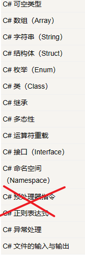
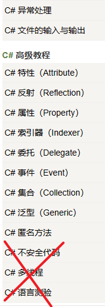
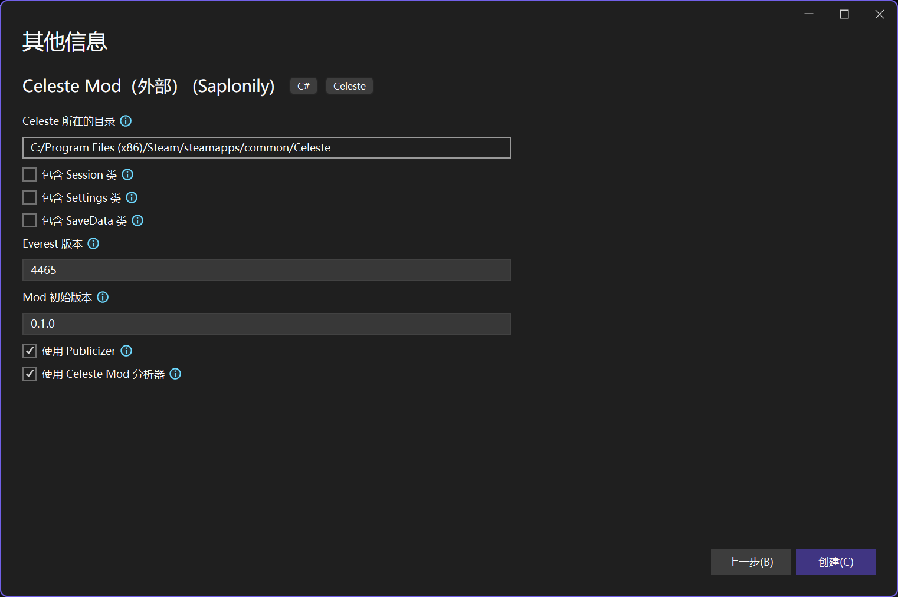
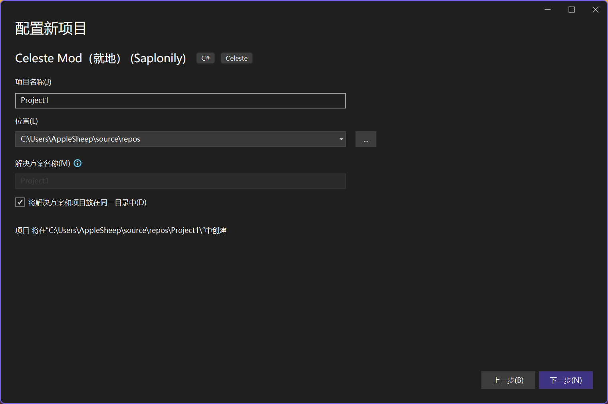

# 基础环境配置

!!! note
    本节内容由手动配置重写为通过模板配置, 旧版你可以到[归档-基础环境配置](../arc/basic_env.md)中找到(不推荐)

## Celeste

!!! note
    如果你不是 Windows 用户的话这一步你可以直接跳过.

!!! info
    在 Everest Core 版本后(Stable 版本号大于 4465)强制切换为了 FNA 版本, 如果你已是 Core 版本你可以跳过这一步.

Everest 需求我们使用 FNA 版本的蔚蓝, 而 Linux 和 MacOS 上的蔚蓝已经就是 FNA 版本了, 而在 Windows 上则是 XNA 版本, 所以我们需要一些方法切换到 FNA 版本:

- 在 Steam 上:  库->Celeste, 右键菜单属性->测试版->Opengl
- 在 itch 上: 重新下载一个 `Celeste Windows OpenGL` 版本
- 在 Epic 上: 已经是 FNA 版本了

!!! note
    Everest 会在运行时将你以 FNA 版本制作的 mod 重链接为 XNA, 所以你不是很需要在意这俩的差距  
    注意更换版本后会变回原版, 你需要重新安装 Everest

## C# 编程能力 与 开发环境

因为我们是 Code Mod, 嗯, 那么写一些代码是必不可少的, 蔚蓝是使用 `C#` 基于 `.NET Framework 4.5.2` 来制作的, 那么学习 `C#` 当然是必不可少的.  
!!! info
    在 Everest Core 版本上蔚蓝被迁移到了 `.NET 7` 上, 不过基于旧框架的 mod 会尽可能地被 Everest 自动转换为基于新框架的 mod.
!!! info
    理论上所有 **.NET 系**语言比如 `VB.NET` `F#` 都可以, 不过为了方便起见我们还是使用 C#.

好吧这句话可能说的太平淡了(, 毕竟大部分<del>蔚批</del>蔚蓝 mod 爱好者就是被这一步卡住的, 那么这里...只能给你推荐几个学习渠道了,
毕竟在这里没必要让这个教程过于全能.

1. 视频: [Bilibili - 丑萌气质狗 - 【C#零基础入门教程 Visual Studio 2022】人生低谷来学C#](https://www.bilibili.com/video/av895726228) (全p, 稍微不全)
2. 视频: [Bilibili - C#从入门到精通（第5版）](https://www.bilibili.com/video/av882929680) (1-71p, 109-132p)
3. 视频: [Bilibili - 刘铁猛 - C#语言入门详解-第1季-剪辑版-全33课-分154集](https://www.bilibili.com/video/av906241776) (1-152p)
4. 网站: [Runnob - C# 教程](https://www.runoob.com/csharp/csharp-tutorial.html)
5. 网站: [w3schools - C# 教程](https://www.w3schools.com/cs/index.php) (英文)
6. 书籍: C#入门经典-第7版-C# 6.0

!!! info
    如果你没有能力支持正版书籍的话, 你可以到一些 C# 开发者群内寻找它的电子非正版(比如视频 `1.` up 的群内)  
    上面几个我更加推荐的是 `1.` 和 `3.`  
    借用 `4.` 的目录, 确保你对下面这些概念(画 × 的暂时在蔚蓝 Code Mod 中用不到)有足够清晰的了解在开始你的蔚蓝 Code Mod 之旅之前:  
    
    
    

相信在上面的教程中你应该已经被推荐了一些编辑器 / IDE, 那么在本教程中我个人会为了方便**仅**在 `Windows` 上使用 `Visual Studio`, 当然不保证在其他地方会遇到奇奇怪怪的问题. \_(:з」∠)\_

## 通过模板创建项目

!!! info
    在蔚蓝国外社区流行着另一个 mod 项目模板, [这是它的 Github 主页](https://github.com/EverestAPI/CelesteModTemplate)
    不过这里主要介绍使用我个人制作也是个人最常用的一个.

!!! note
    项目模板在重构的教程中进行了更新, 旧版你可以在[归档-通过模板创建项目](../arc/project_template.md)中找到(不推荐)

我们在这里提供两种模板:

- 外部: 在蔚蓝根目录外编写代码.
- 就地: 在 `Celeste/Mods/<你的 Mod 名称>/Source` 中编写代码.

我们在下面会使用 `Visual Studio` 进行演示.
或者你也可以选择使用 `dotnet cli` 从 nuget 上的模板安装:

!!! note
    你可能还需要安装 `.NET 8 SDK` 来使用该模板, 你可以[在这里](https://get.dot.net)找到它

??? info "使用 dotnet cli 从模板新建项目"
    首先在一个你喜欢的位置放置你的项目文件夹, 名字即为你的项目名, 例如 `MyCelesteMod`:
    ```bat
    mkdir MyCelesteMod
    cd MyCelesteMod
    ```
    然后在此位置安装 nuget 上我的 mod 模板(如果你没有安装的话):
    ```bat
    dotnet new install Saladim.CelesteModTemplate
    ```
    然后你就能使用这条指令直接创建外部模板了:
    ```bat
    dotnet new sapcelestemode
    ```
    如果需要就地模板使用这条指令:
    ```bat
    dotnet new sapcelestemodi
    ```
    下面是可选择的一些参数:

    - `-n`: 你的 Mod 名称, 默认为 `MyCelesteMod`, 用于重写项目名字, 例如 `-n YourCelesteMod`.
    - `-c`: 指定蔚蓝根目录(只对外部模板生效), 例如 `-c "C:\Program Files\steam\steamapps\Celeste"`.
    - `-up`: 是否使用 Publicize 后的 Celeste 程序集, 默认开启, 关闭可以 `-up false`.
    - `-ua`: 是否使用 Celeste Mod 分析器, 默认开启, 关闭可以 `-ua false`.
    - `-ss`: 向项目中添加 `Session` 类并在 `Module` 中自动配置, 默认关闭.
    - `-st`: 向项目中添加 `Settings` 类并在 `Module` 中自动配置, 默认关闭.
    - `-sd`: 向项目中添加 `SaveData` 类并在 `Module` 中自动配置, 默认关闭.
    - `-ev`: 指定 `everest.yaml` 中的 `EverestCore` 版本, 默认为 `4465`.
    - `-mv`: 指定 `everest.yaml` 中的你的 Mod 的初始版本, 默认为 `0.1.0`.

首先我们打开命令行, 输入以下命令进行安装:
```bat
dotnet new install Saladim.CelesteModTemplate
```

完成后打开 `Visual Studio`, 选择 `创建新项目`, 然后在搜索框中输入 `Celeste`, 你应该能看到以下两个模板:


### 外部模板

选择并填写好项目名称之后, 你应该能看到以下内容:


其中的各选项详细信息可以把鼠标移到旁边的 `info` 图标进行查看.

完成创建后你可以按下 `Ctrl+B` 或者手动点击 `生成->生成解决方案`,
如果你在你的 vs 输出里面看到了类似这两句:

```
1>MyCelesteMod -> D:\User\temp\cm\bin\x86\Debug\net452\MyCelesteMod.dll
1>MyCelesteMod -> C:/Program Files (x86)/Steam/steamapps/common/Celeste/Mods/MyCelesteMod_copy/MyCelesteMod.dll
```

并且你在你的蔚蓝 Mod 目录下找到了这个被创建的目录,
那么你的环境就算是配完了, 如果你很感兴趣这之中发生了什么, 要引用哪些程序集, 这个模板背后干了什么, 你可以去看那复杂的旧的配置方法.
!!! note
    这个模板使用 `msbuild` 帮助了你很多事!  
    比如当你编译完项目之后它会复制编译结果到项目目录的 `ModFolder` 目录下,
    然后将整个 `ModFolder` 复制到蔚蓝的 `Mods\{你的mod名}_copy` 文件夹下!
    所以当我们需要更改一些比如说 loenn 的配置文件, `everest.yaml` 的内容, 你的测试地图等时, 
    你只需要简单地重新编译一遍项目, 然后等待模板来帮你做剩下的活!  

### 就地模板

就地模板在进行项目名称填写时你应该会看到以下内容:


这里的 `项目名称` 就是你的 Mod 名称.    
`位置` 我们需要改到蔚蓝的 `Mods` 目录下, 例如 `C:\Program Files\steam\steamapps\Celeste\Mods`.     
填写完成后我们还需要勾选 `将解决方案和项目放在同一目录中`.

后面的项目配置基本与外部模板一致, 除了 `Celeste 所在的目录`. 这项已经在上一步的 `位置` 填写过了所以不需要再填写.

## Module 类

就像我们的经典的控制台 C# 应用程序一样有个 `Main` 方法, 我们的蔚蓝 Mod 也有一个类似的东西, 
那就是 Everest 提供给我们的 `EverestModule` 类.  
那么, 现在打开你的 `MyCelesteModModule.cs` 那个文件, 你应该会看到类似结构这样的代码:
```cs
namespace MyCelesteMod;

public class MyCelesteModModule : EverestModule
{
    public override void Load()
    {
        
    }

    public override void Unload()
    {
    }
}
``` 
在开头我们声明了命名空间, 接下来我们声明了一个类, 然后让它继承于 `EverestModule`, 注意这个类是抽象的, 它要求我们实现的两个方法分别为 `Load` 与 `Unload`.  
这两个方法很简单:

- `Load` 方法在你的 mod 被加载时调用.
- `Unload` 方法在你的 mod 被卸载时调用.

通常我们会在 `Load` 方法里加载我们需要的资源, 进行适当的初始化, 在 `Unload` 方法里释放我们的资源.  
在这里为了明显可见, 我们在 `Load` 方法里通过一个蔚蓝中的类 `Logger` 打印出了一句 "Hello World".

??? note "如果你好奇 `Logger.Log` 这个方法你可以展开来了解"
    `Logger` 是一个蔚蓝底层引擎 `Monocle` 的一个工具类, 它帮助你打印输出一些调试信息,
    通常这些信息会被打印进控制台的同时写入游戏的 `log.txt` 文件中, 
    这也就解释了为什么你遇到各种问题时别人总要求你发送你的 `log.txt`.  
    `Logger.Log` 有两个重载, 其中一个的签名是:
    ```cs
    public static void Log(LogLevel logLevel, string tag, string str)
    ```
    它会以 `logLevel` 的日志等级打印一个标签为 `tag` 的消息 `str`,
    另一个重载不要求你传入 `logLevel` 但会默认你的 `logLevel` 为 `LogLevel.Verbose`.
    `LogLevel` 枚举包含 `Verbose, Debug, Info, Warn, Error`.
    通常对于普通日志我们会选择 `Info`, 对于较多的调试信息选择 `Debug`,
    对于冗余的信息选择 `Verbose`, 对于一些错误但不影响游戏进行的信息选择 `Warn`, 对于一些致命性错误我们会选择 `Error`.
    一般地, 游戏只会打印 `Info` 等级及以上的日志, 你可以通过在蔚蓝启动的命令行中加入`--loglevel {等级}`来指定过滤等级.

## everest.yaml

ok, 我们前面几乎巴拉巴拉讲了几乎三千多个字, 但是依然没有让蔚蓝加载到我们的mod, 不过别急, 这是倒数第二步了.  
实际上有关 code mod 的所有代码相关的东西我们都已经做完了, 剩余的其实只是一个普通 mod 要做的 ---- 写 `everest.yaml`.
在这里我们需要在 `ModFolder` 这个文件夹里做这件事, 那么, 在你的这个文件夹下创建 `everest.yaml` 空文件, 你的目录结构可能像是:  

!!! note
    `.dll` 文件和 `.pdb` 文件仅会在你构建过项目后出现, 有时候甚至 ModFolder 目录也会在构建过后出现

- ModFolder
    - everest.yaml
    - MyCelesteMod.dll
    - MyCelesteMod.pdb

好的, 现在我们打开 `everest.yaml`, 然后像一个普通的 mapper 一样填写信息:
```yml
- Name: MyCelesteMod
  Version: 0.1.0
  DLL: MyCelesteMod.dll
  Dependencies:
    - Name: Everest
      Version: 1.4465.0
```
这些参数分别是:

- `Name`: 你的 mod 名字
- `Version`: 你的 mod 的版本
- `DLL`: 如果你是 code mod 的话, 这里填入你的 code (也就是 dll 文件) 的位置, 这里我们是直接把 .dll 文件放到这个 yaml 的旁边了, 所以直接写名字就好

最后是最底下的那个依赖, 这里我们只依赖最基础的 Everest, 版本填上你目前使用的 Everest 版本, 这里我就填写 3971 了.
如果你的 mod 依赖 Everest Core, 你需要在这里将 `Everest` 更改为 `EverestCore`, 并将版本号填写大于 4465 的值.

## 最后一步

为了方便我们的调试, 我们需要让蔚蓝打开的同时打开控制台, 这一步很简单:

- 找到蔚蓝根目录下的 `everest-launch.txt`, 没有的话新建一个空的就行了
- 向里面写入 `--console`
- 搞定, 走你!

现在, 重新编译项目, 让 `msbuild` 带着你的 `ModFolder` 的内容前往蔚蓝 Mods 文件夹下, 启动蔚蓝.  
在同时启动的黑乎乎的命令行窗口上你应该能在这附近看到那句熟悉的 Hello world:
```log hl_lines="7"
(07/08/2023 21:18:59) [Everest] [Info] [core] Module DialogCutscene 1.0.0 registered.
(07/08/2023 21:18:59) [Everest] [Info] [core] Module UpdateChecker 1.0.2 registered.
(07/08/2023 21:18:59) [Everest] [Info] [core] Module InfiniteSaves 1.0.0 registered.
(07/08/2023 21:18:59) [Everest] [Info] [core] Module DebugRebind 1.0.0 registered.
(07/08/2023 21:18:59) [Everest] [Info] [core] Module RebindPeriod 1.0.0 registered.
(07/08/2023 21:19:00) [Everest] [Info] [Everest.LuaBoot] Lua ready.
(07/08/2023 21:19:00) [Everest] [Info] [MyCelesteMod] Hello World!
(07/08/2023 21:19:00) [Everest] [Info] [core] Module MyAwesomeMod 0.1.0 registered.
(07/08/2023 21:19:00) [Everest] [Info] [loader] Loading mods with unsatisfied optional dependencies (if any)
FNA3D Driver: D3D11
D3D11 Adapter: Intel(R) UHD Graphics 630
```
<!-- 肯定会有人在意怎么是 630 核显( -->

在经过如上的配置后, 你会发现在蔚蓝启动的时候, 进行编译并复制资源时会报错, 
这是因为 Everest 锁定占用了它们, 导致你不得不让这一切在蔚蓝关闭时进行,
同时由于蔚蓝的重启速度不是很理想, 这大大的拉低了 mod 开发效率.  
不过好在 Everest 提供了一个技术叫做 `code hot reload`,
即热重载, 它允许你在游戏运行期间替换你的代码并重载资源, 它目前还在 wip 状态.  
要开启这项功能, 首先到你的蔚蓝根目录下的 Saves 目录, 找到并打开 `modsettings-Everest.celeste` 这个文件,
翻到大概中间的位置, 找到属性 `CodeReload_WIP`, 将其更改为 `true`, 此时重新编译你的项目,
你应该就不会再得到任何错误, 并且 Everest 也正确地热重载了你的 mod 和你的 mod 资源.


这一节完成后你的目录结构大概会像是          
外部模板:

- MyCelesteMod (你的根目录)
    - ModFolder
        - Code
          - MyCelesteMod.dll
          - MyCelesteMod.pdb
        - everest.yaml
    - CelesteMod.props
    - CelesteMod.targets
    - MyCelesteMod.csproj
    - MyCelesteModModule.cs

或 就地模板:

- MyCelesteMod (你的根目录)
    - everest.yaml
    - Source
        - CelesteMod.props
        - CelesteMod.targets
        - MyCelesteMod.csproj
        - MyCelesteModModule.cs
        - .everestignore
    - Code 
        - MyCelesteMod.dll
        - MyCelesteMod.pdb

其中正如之前所介绍的, 我推荐如果你使用该外部模板的话, mod 的资源文件应该放在 `ModFolder` 中, 然后就像往常一样放置你的 mod 资源, 当你的项目在构建时它们会自动被复制.
并且将代码文件放置在 .csproj 同目录下或嵌套文件夹下,
如果你没有更改你的项目而只更改了资源文件时你会发现编译项目会因为 "所有文件都是最新的" 而跳过编译, 而同时也会跳过我们的资源复制, 对此的话我们有两种解决方案:

- 直接强制重新构建项目 (vs 中 "生成" -> "重新生成项目")
- 在项目根目录执行 `msbuild -target:PostModBuild` 命令行

> 好像是有更好的解决方法, 不过鉴于本人 MSBuild 知识不足只能做成这样了(x
